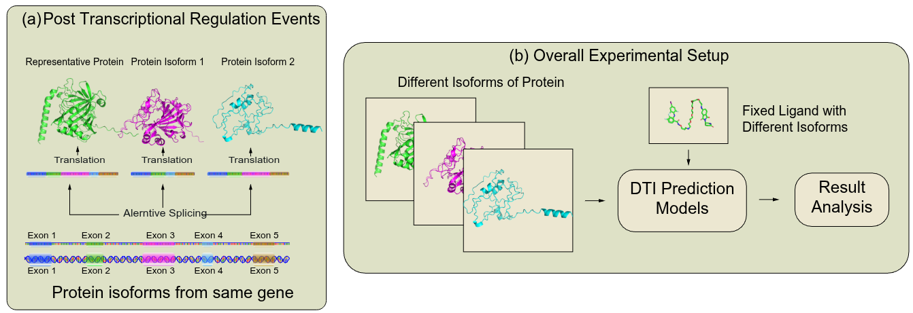
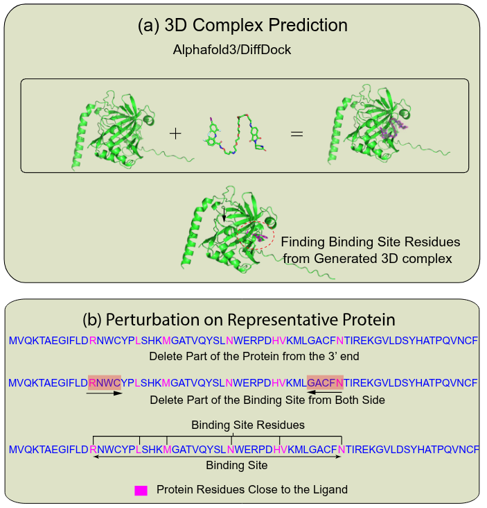
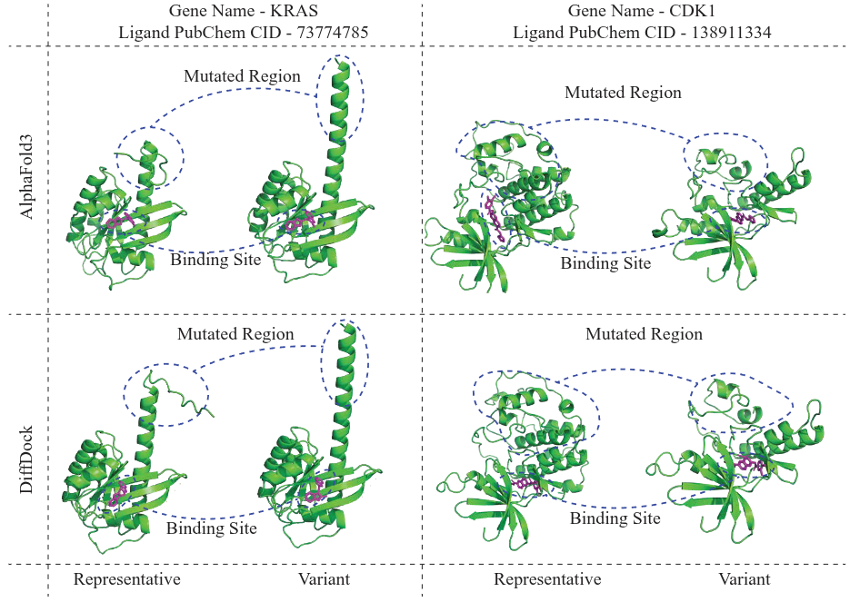
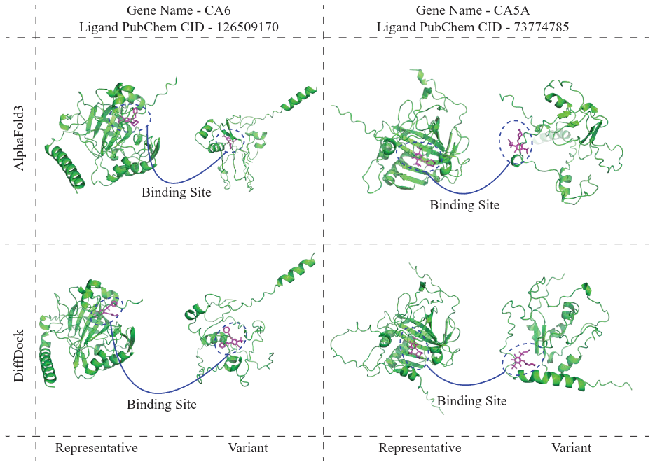

# Beyond the Canonical: The Role of Post-transcriptional Regulation in Drug-Target Interaction Prediction

This repository contains the code, data processing scripts, and analysis workflows accompanying the manuscript:

**Beyond the Canonical: The Role of Post-transcriptional Regulation in Drug-Target Interaction Prediction**

## Overview

Most drug–target interaction (DTI) and drug–target affinity (DTA) prediction models use a single representative protein isoform per gene, typically the canonical or longest sequence. This repository supports a study showing that replacing representative proteins with alternative isoforms can substantially change model predictions, degrade predictive performance, and reveal hidden assumptions in current DTI modeling pipelines.

The project investigates how post-transcriptional regulation, especially alternative splicing, affects sequence-based DTI and DTA prediction by evaluating model behavior under isoform substitution and controlled perturbation of binding-site residues.

## Overall Pipeline

<p align="center">
  
</p>

<p align="center">
<b>Figure:</b> Overall pipeline of the experiments. (a) Alternative splicing produces different isoforms from the same gene. (b) For a fixed ligand, we analyze how the DTI prediction model behaves for different isoforms of proteins produced from the same gene as a result of post-transcriptional regulation events.
</p>

## Binding-site Identification and Perturbation Pipeline

<p align="center">
  
</p>

<p align="center">
<b>Figure:</b> Steps for identifying binding-site residues and evaluating sequence perturbations. 
(a) Protein sequences are paired with ligands and processed using DiffDock/AlphaFold3 to generate the most probable protein–ligand binding pose. Binding-site residues are then identified based on their spatial proximity to ligand atoms using a distance threshold. 
(b) The identified binding-site residues are used to generate modified protein sequences under specific perturbation conditions. Representative proteins, isoform proteins, and modified sequences are then evaluated using DTI prediction models to analyze changes in predicted interactions.
</p>

## Main contributions

- Evaluation of **isoform sensitivity** in DTI prediction
- Comparison of representative isoforms and alternative isoforms from the same gene
- Analysis of prediction consistency using **3D structural comparisons**
- Controlled deletion experiments on predicted binding-site regions
- Affinity prediction analysis under progressive protein sequence perturbation

## Datasets

This work uses two public datasets:

- **DrugBank** for binary drug–target interaction labels
- **BindingDB** for experimentally measured binding affinities, converted to binary interaction labels using a threshold on Kd values. Both datasets have been prepared for the experiments described in the manuscript. They are 
- Train data with representative isoforms 
- Train data with variant isoforms 
- Test data with representative isoforms
- Test data with variant isoforms 

Both datasets are provided in proper format for DTILM ([link](https://drive.google.com/drive/folders/1A5fvXrYfcOYhBNVXhZLuT_4V_iZOqt5k?usp=drive_link)) and Moltrans ([link](https://drive.google.com/drive/folders/1Kk-s9rkWcl_pLrgLSd_JpTu8Z_Ir5K6I?usp=drive_link)). 

Protein isoform sequences are collected from **Ensembl** and **GENCODE** are also proivded [here](https://drive.google.com/drive/folders/1Un7IImRgb--_8X40aHA7VUu-sEUK29Dk?usp=drive_link)


## Experiments included

### 1. Isoform substitution in DTI prediction
Representative protein sequences are replaced with alternative isoforms during training or testing while keeping interaction labels unchanged. The goal is to measure how sensitive DTI models are to biologically realistic isoform variation. 

## DTI Prediction Performance – DrugBank Dataset

| Model   | Training Data | Test Data | TN | FP | FN | TP | F1   | AUC  |
|--------|---------------|-----------|----|----|----|----|------|------|
| DTI-LM | Rep. iso | Rep. iso | 635 | 86 | 79 | 687 | 0.893 | 0.945 |
| DTI-LM | Rep. iso | Var. iso | 528 | 72 | 381 | 266 | 0.540 | 0.712 |
| DTI-LM | Var. iso | Rep. iso | 580 | 141 | 194 | 572 | 0.773 | 0.856 |
| MolTrans | Rep. iso | Rep. iso | 603 | 102 | 131 | 636 | 0.845 | 0.908 |
| MolTrans | Rep. iso | Var. iso | 569 | 30 | 508 | 141 | 0.344 | 0.647 |
| MolTrans | Var. iso | Rep. iso | 600 | 102 | 296 | 474 | 0.700 | 0.814 |

**Table:** DTI prediction performance of DTI-LM and MolTrans on the DrugBank dataset.  
Representative isoforms (**Rep. iso**) and variant isoforms (**Var. iso**) are used in different combinations for training and testing. Metrics reported include True Negative (TN), False Positive (FP), False Negative (FN), True Positive (TP), F1 score, and AUC.

## DTI Prediction Performance – BindingDB Dataset

| Model   | Training Data | Test Data | TN | FP | FN | TP | F1   | AUC  |
|--------|---------------|-----------|----|----|----|----|------|------|
| DTI-LM | Rep. iso | Rep. iso | 439 | 69 | 52 | 463 | 0.884 | 0.953 |
| DTI-LM | Rep. iso | Var. iso | 391 | 35 | 214 | 274 | 0.688 | 0.864 |
| DTI-LM | Var. iso | Rep. iso | 431 | 77 | 112 | 403 | 0.810 | 0.908 |
| MolTrans | Rep. iso | Rep. iso | 418 | 52 | 38 | 276 | 0.860 | 0.945 |
| MolTrans | Rep. iso | Var. iso | 353 | 41 | 130 | 148 | 0.634 | 0.833 |
| MolTrans | Var. iso | Rep. iso | 415 | 55 | 75 | 239 | 0.786 | 0.908 |

**Table:** DTI prediction performance of DTI-LM and MolTrans on the BindingDB dataset.  
Representative isoforms (**Rep. iso**) and variant isoforms (**Var. iso**) are used in different combinations for training and testing. Metrics reported include True Negative (TN), False Positive (FP), False Negative (FN), True Positive (TP), F1 score, and AUC.

To run it using **DTILM** follow the instructions below. Copy the datasets from the provided links and put it in the corresponding folders before running the model.

```cd DTILM```

for BindingDB dataset 

```python run.py --config-name bindingDB_train_GAT.yaml "tuning.param_search.tune=False" "datamodule.splitting.balanced=True" "datamodule.splitting.splitting_strategy=random"```

for DrugBank dataset

```python run.py --config-name drugbank_train_GAT.yaml "tuning.param_search.tune=False" "datamodule.splitting.balanced=True" "datamodule.splitting.splitting_strategy=random"```

To change the training and testing dataset, modify the config file ```configs/bindingDB_train_GAT.yaml``` or ```configs/drugbank_train_GAT.yaml``` , under **variant_pred** change the **train** and **test** variables to one of *default* or *furthest*.

To run it using **Moltrans** follow the instructions below

```cd MolTrans```

in the *run_variant.py* file edit the *dataset*, *train_type* and *test_type* variable for desired dataset and run 

```python run_variant.py```

### 2. Structural analysis of matched and mismatched predictions
Depending on prediction made by **DTILM** or **Moltrans** Protein–ligand pairs are grouped into:
- **Matched pairs**: same prediction for representative and variant isoforms
- **Mismatched pairs**: different predictions for representative and variant isoforms
Run **DTILM** with *default* train twice, test with *default* and *furthest*. The test logs will be saved in *3d_analysis* folder. Run the *analysis.ipynb* to get the results on 3D analysis and sequence similarity experiments. 

Their predicted 3D complexes are compared to examine whether prediction consistency is associated with preservation of binding-site geometry. Use [AlphaFold3](https://github.com/google-deepmind/alphafold3) ro [DiffDock](https://github.com/gcorso/DiffDock) to generate the 3D complexes for Protein-Ligand pairs and provide the path to the complexes for each pair in the code. Follow instructions provided in their respective repositories to generate 3D complexes. 
## Structural Comparison – Matched Prediction Pairs

<p align="center">
  
</p>

<p align="center">
<b>Figure:</b> Structural comparison of protein–ligand complexes for <b>Matched</b> DTI prediction pairs, where the representative and variant proteins yield the same prediction. Representative and variant protein pairs are shown in 3D in complex with a specific ligand. The complexes are generated using both AlphaFold3 and DiffDock.
</p>

## Structural Comparison – Mismatched Prediction Pairs

<p align="center">
  
</p>

<p align="center">
<b>Figure:</b> Structural comparison of protein–ligand complexes for <b>Mismatched</b> DTI prediction pairs, where the representative and variant proteins yield opposite predictions. Representative and variant protein pairs are shown in 3D in complex with a specific ligand. The complexes are generated using both AlphaFold3 and DiffDock.
</p>


### 3. Progressive binding-site deletion
Protein sequences are modified by gradually deleting residues from predicted binding-site regions. This evaluates how strongly DTI models depend on localized interaction-relevant residues.

For **DTILM** 
Modify *DTILM/datamodule/dataloader_GAT2.py* between lines 33 and 38. Uncomment the line for your desired experiment and set the value of *percent* value with desired percentage you want to delete. 
- seq = get_modified_seq(seq,smile)  -> for deleting binding site based on DiffDock generated complexes
- seq = get_modified_seq_alpha(seq,smile) -> for deleting binding site based on AlphaFold3 generated complexes
- seq = get_3_prime(seq) -> for deleting protein from C-Terminal

For **Moltrans** 
Modify *Moltrans/stream.py* between lines 98 and 105. Uncomment the line for your desired experiment and set the value of *percent* value with desired percentage you want to delete. The functions are named identically as described for **DTILM** above. 


### 5. Affinity prediction under sequence perturbation
[AttentionDTA](https://github.com/zhaoqichang/AttentionDTA_TCBB/) is used to measure how protein sequence deletion affects predicted binding affinity. The experiment is run with progressive deletion of binding-site or protein from C-Terminal. The choice can be modified at *AttentionDTA/dataset.py* line 61-63 with same functinality as DTILM and Moltrans. To run it , 
```cd AttentionDTA```
```python train.py```

This will run the model for 0 to 100 deletion of binding-site. When deleting from C-terminal, use 10-90 deletion. This applies for DTILM and Moltrans as well. 

## Installation

To run each method please the corresponding repository for setting up the conda environment and software requirements. 